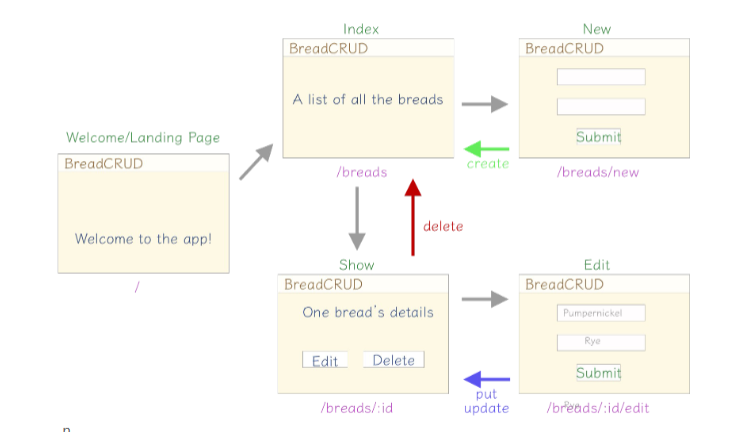
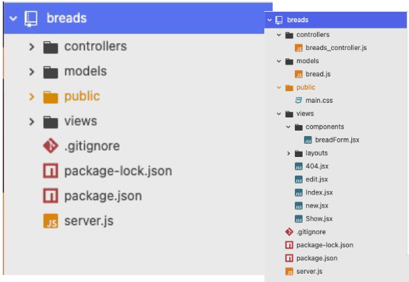

# my_BE_project

This file will cover everything I learned in BE Development as a review for helping me start my own CRUD app.

## FOLDERS PURPOSE

- server.js - this is where the main file where everything is connected too
- ./views - This is where our HTML pages will be for displaying to the browser.
- ./public - This is where the css, images and any other files that can be shown to anyone. You wouldnt keep anything private in this folder.
- ./models -
- ./controllers -
- .gitignore - Keeps files untrackable so when you push the folder up to github those files dont go to github.
- .env - holds the PORT number for running the live server.
- ./layouts - Holds premade templates for working with jsx to make it easier to make more pages quicker with a jumpstart.

## NPM PACKAGES:

- npm init -y - Creates the package.json file we need.
- npm install {name of package} - This installs the packages you want.
- npm install -g {name} - This installs packages globaly if you have to use it in multiple locations.

- npm install -g nodemon - this would be used globaly.
- npm install express - this is a web framework.
  // to require a node module use this syntax: { const express = require('express') }
  // initialize your express app: { const app = express() }
- npm install dotenv - this is an environment variable.
  // In a .env file write - PORT=3000 - This is the port you go to when running nodemon
- npm install express-react-views - this lets us use react with express for SSR.
- npm install method-override - Our app doesnt understand that we are trying to override the POST request. We need this to solve the problem. (day 5)

## MERN stack

- A mern stack is

- MongoDB - Is a database for all our data.
- ExpressJS -
- ReactJS - Is a javascript library which helps us do more with less. Its a combination of HTML and JavaScript.
- NodeJS - Is a javascript runtime. this means we can run javascript on any computer.

## C.R.U.D:

- Post(Create data) - Data not visible, Encrypted, Good for private information.
- Get(Read data) - Visible data, Not encrypted, Good for public information.
- Put/Patch(Update data)
- Delete(Delete data)

## Getting Started:

A basic Express server

1. install: {npm init -y}, then {npm install express}
2. require and initialize: {const express = require('express')}, then initialize {const app = express()}
3. Create a homepage route:
   ```
   app.get('/', (req, res) => {
   // This goes to the client(web browser)
   res.send('Hello World!')
   })
   ```
4. Listen for connections at the bottom: {app.listen(3000)} or {app.listen(3000, () => {
   console.log('I am awake!')
   })}
5. to create a second route just repeat step 3 and change the route - app.get('/second')
6.

## Notes:

### Day 1

- HTTP - Stands for, Hypertext Transfer Protocol. The bases for how data is exchanged over the web.
- Anatomy of a URL - See a image for refrence. [https://pbs.twimg.com/media/EzLO6aeVoAcYyYM.jpg]
  •Protocol: Determines which protocol to use
  •Host/Domain: The address of the server providing resources
  •Path: The path to the exact resource of the server you want to access
  •Fragment: Identifies a specific section of the response
- Node.js - Node can run server-side code or a script apart from the web entirely! Basically its a way to run JS with persistent connection from the browser to the server.
- Node.js gives us {require}, Global process variables, npm of code from other people.
- Node.js losses access to browser and DOM.
- Module - A single JS file with inter-related functionality.
- Package - One or more related modules packed together.
- const name = require('name') - This is a dependency, it gets the specific package.
- Nodemon - monitors your code changes and automatically restarts your server as needed
- HTTP Status Codes - to check status. Go to -> developer tools -> Network tab
  1xx - An informational response(rarely seen)
  2xx - Things went ok
  3xx - There was some type of redirect
  4xx - The client likely did something wrong
  5xx - The server likely did something wrong

### Day 2

- Web Frameworks - make it easier to write, maintain, and scale web applications.
- Framework: Express, Language: Node.js
- Framwork: Flask, and django, Language: python
- Monolithic: Many built in features. Preset configurations.
- Modular: Highly customizable. Choice with configuration.
- Express is a modular framework.
- Environment variable: are used to avoid hard coded data, protect private data, and machine settings.
- You may need both a GET and POST route for a path. This is because the GET path will render a page with a login form and a POST path will accept and process information from the login form.
- controllers - A controller file allows you to put files in other files besides index.js and helps keep them organized.
- Making a controller to export file: In controllers/name.js =>

```
 const router = express.Router()

 router.get('/login', (req, res) => {
 res.send('A get route!')
 })

 module.exports = router
```

- Import routes to your index.js from controller:

```
const express = require('express')
const app = express()

app.get('/', (req, res) => {
res.send('Home Page')
})

app.use('/name', require('./controllers/name'))

app.listen(3000)
```

- Create a 404 message: This route goes last or else it catches valid routes.

```
  app.get('/*', (req, res) => {
  res.send('Nice page, not an ugly error')
  })
```

- Postman - is used for testing APIs and applications while they are in development. Also tests routes.

### Day 3

- This is a CRUD diagram that shows our views and routes.
  
- example of a finished project file:
  
- SSR: Server side rendering.
- MVC - is the workflow based on three major components of the MERN stack. Stands for Models, Views and Controllers.
  CONTROLLERS - establish a connection between the router and models. As routers and models do not interact directly they carry instruction through controllers. This is the reason most functions and middleware objects are coded in the controller. Which can be used anywhere.
  ROUTES - Routes handle all the routing process in the project. This is used to create API and then can be used with different front end technologies. example: react, angular or basic HTML CSS JS.
  MODELS - Models handle all the Schema required in the project. It can be used to create a connection between multiple schemas. It handles the information and exchanges it with the database(MongoDB). Which stores all of the information.
- MIDDLEWEAR in server.js - Should be above all route s. We are setting up which view engine will be used and requiring JSX so we can utilize it to build our views.

```
// MIDDLEWARE
app.set('views', __dirname + '/views')
app.set('view engine', 'jsx')
app.engine('jsx', require('express-react-views').createEngine())
```

### Day 4

- RESTFUL ROUTES - REST -
  - Utilizes HTTP verbs to keep unique paths to a minimum
  - Creates an easily understandable and maintainable pattern
  - Provides flexibility, while limiting unique routes
- What does REST stand for -
  - Representational
  - State
  - Transfer

### Day 5

Review routes

```
 Action    HTTP METHOD   Example Route      View
  INDEX       GET       /breads              index.jsx
  SHOW        GET       /breads/:id          show.jsx
  CREATE      POST      /breads              none - creates a new item in our database
  NEW         GET       /breads/new           new.jsx
  EDIT        GET       /breads/:id/edit
  UPDATE      PUT       /breads/:id
  DESTROY   DELETE      /breads/:id
```

### PROJECT INSTRUCTIONS

- Create a repo on github.
- This will make a new directory within the terminal after you create a file for your new project.

```
  cd breads
  touch server.js
  touch .env
  npm init -y
  npm install express dotenv
```

- In .env file add the port:

```
  PORT=3003
```

- In server.js:

```
// DEPENDENCIES
const express = require('express')

// CONFIGURATION
require('dotenv').config()
const PORT = process.env.PORT
const app = express()

// ROUTES
app.get('/', (req, res) => {
  res.send('Welcome to an Awesome App about Breads!')
})

// LISTEN
app.listen(PORT, () => {
  console.log('nomming at port', PORT);
})
```

- Confirm it shows in browser with nodemon.
- In controllers/ computer_controllers.js

```
const express = require('express')
const breads = express.Router()

// INDEX
breads.get('/', (req, res) => {
  res.send('This is the index at /breads')
})

module.exports = breads
```

#### Decided not to continue this part
